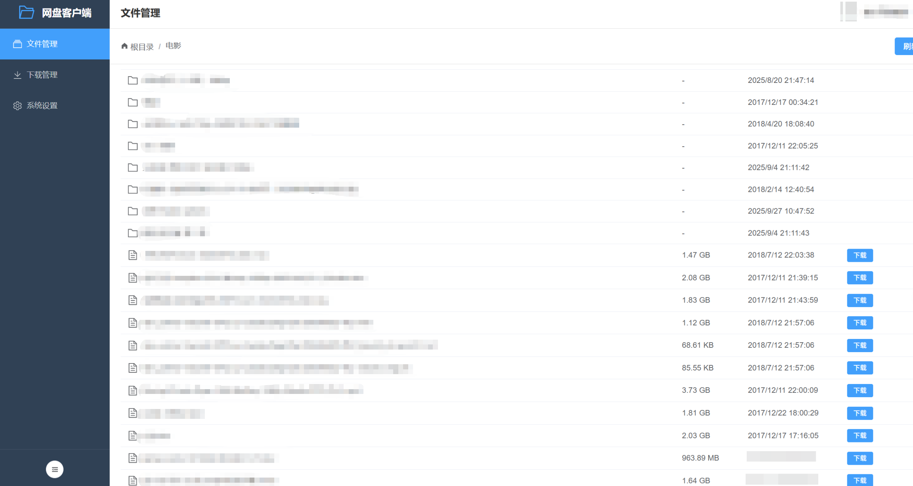
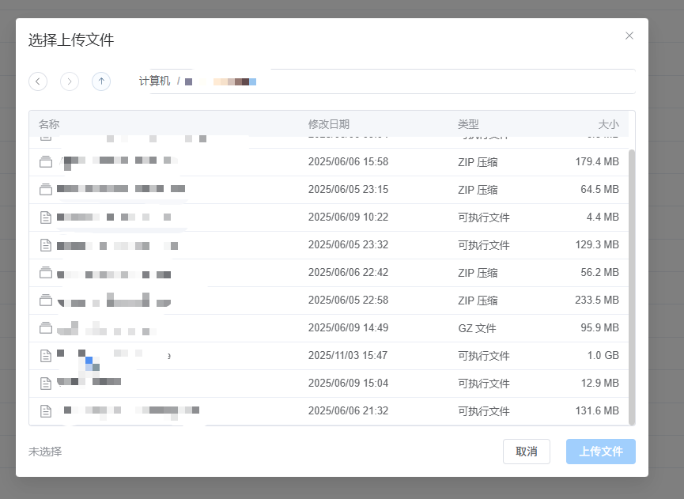
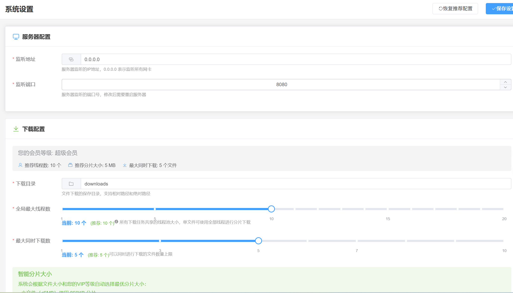

# BaiduPCS-Rust

<div align="center">


🚀 基于 Rust + Vue 3 的高性能百度网盘客户端 | High-performance Baidu Netdisk client built with Rust and Vue 3

[功能特性](#-功能特性) • [快速开始](#-快速开始) • [技术栈](#️-技术栈) • [项目结构](#-项目结构) • [版本历史](#-版本历史) • [贡献](#-贡献)

</div>

---

## 📖 简介

BaiduPCS-Rust 是一个使用 Rust 和 Vue 3 构建的现代化百度网盘第三方客户端，提供简洁的 Web 界面和高效的上传/下载功能。

## ⭐ 支持项目发展

如果这个项目对你有帮助，请点一个 **Star** 支持！

<div align="left">

[](https://github.com/komorebiCarry/BaiduPCS-Rust/stargazers)

</div>

> 你的 Star 会让我更有动力持续更新 🚀

### 🎯 项目初衷

本项目主要是为了解决以下痛点：

- **NAS 环境下的下载速度问题**：虽然已经是百度网盘会员，但在 NAS 设备上使用官方百度网盘客户端无法实现满速下载，影响使用体验
- **高性能下载需求**：通过多线程并发下载、断点续传等技术，充分利用会员带宽，实现满速下载
- **自动备份功能**：支持将本地文件自动备份到百度网盘，实现数据的安全存储和同步
- **增强上传体验**：支持文件/文件夹上传、秒传能力与上传任务管理，让本地备份到网盘的过程更可控
- **跨平台支持**：支持 Windows、Linux、macOS 等多种平台，方便在不同设备上使用
- **现代化体验**：提供简洁美观的 Web 界面，支持实时进度显示和任务管理

### 🙏 致谢

本项目参考并受到了以下优秀项目的启发：

- [qjfoidnh/BaiduPCS-Go](https://github.com/qjfoidnh/BaiduPCS-Go) - BaiduPCS-Go 的增强版本，提供分享链接/秒传链接转存功能
- [GangZhuo/BaiduPCS](https://github.com/GangZhuo/BaiduPCS) - 百度网盘命令行客户端

感谢这些项目的开源贡献，为本项目的开发提供了重要参考。

---

## ✨ 功能特性

### 🔐 认证系统
- ✅ 二维码扫码登录（百度网盘 APP 扫码）
- ✅ 自动会话管理
- ✅ 会话持久化
- ✅ 自动登录状态验证
- ✅ 失效自动跳转登录页

### 📁 文件管理
- ✅ 浏览网盘文件和目录
- ✅ 目录导航（面包屑）
- ✅ 文件列表展示（表格视图）
- ✅ 文件信息展示（名称、大小、时间、类型）

### ⬇️ 下载引擎
- ✅ 单文件下载（多线程并发下载，8 个并发分片，可配置）
- ✅ **文件夹下载**（递归下载整个文件夹，自动扫描并创建任务）
- ✅ **批量下载**（支持多文件/文件夹同时下载）
- ✅ 断点续传支持
- ✅ 速度限制（可配置）
- ✅ 实时进度显示（下载速度、进度百分比、ETA）
- ✅ 任务队列管理
- ✅ 暂停/继续/删除功能
- ✅ URL健康管理和智能淘汰策略
- ✅ **CDN链接刷新三层检测机制**（速度异常检测、线程停滞检测、定时强制刷新）
- ✅ **下载文件资源管理器**（选择下载目录，支持最近目录记忆）

### ⬆️ 上传引擎与任务管理
- ✅ 统一的上传任务列表视图（上传管理页面）
- ✅ 支持选择本地文件或文件夹发起上传（通过本地文件资源管理器）
- ✅ **批量上传**（支持多文件/文件夹同时上传）
- ✅ **统一上传按钮**（文件和文件夹使用同一个上传入口）
- ✅ 上传任务进度实时展示：已上传大小、总大小、上传速度、剩余时间（ETA）
- ✅ 任务控制：暂停/继续/重试/删除
- ✅ 秒传标识：支持后端秒传时，在任务上展示"秒传"标记
- ✅ **上传最近目录记忆**（自动记录最近使用的上传目录）

### 🎨 Web 界面
- ✅ 现代化 Vue 3 + Element Plus UI
- ✅ 响应式设计
- ✅ 实时状态更新
- ✅ 友好的用户体验
- ✅ 移动端适配

### 💻 本地文件资源管理器（上传文件选择器）
- ✅ 仿系统"资源管理器"的本地文件浏览体验
- ✅ 支持根目录、前进/后退、返回上一级、刷新等导航操作
- ✅ 支持文件/目录/文件或目录三种选择模式（根据上传场景配置）
- ✅ 支持分页加载和"加载更多"，适配大目录场景
- ✅ 提供空态/错误态 UI，操作失败可一键重试

### 🔗 转存功能
- ✅ **分享链接转存**（支持转存百度网盘分享链接到自己的网盘）
- ✅ 提取码验证（支持带提取码的分享链接）
- ✅ 转存后自动下载（可选，转存成功后自动创建下载任务）
- ✅ 转存任务管理（查看转存进度和状态）

### 🐳 部署支持
- ✅ Docker 一键部署
- ✅ Docker Compose 支持
- ✅ 多阶段构建优化

### 📡 实时与持久化能力
- ✅ 任务持久化与断点恢复
- ✅ WebSocket 实时推送
- ✅ 日志持久化与滚动

---

## 📋 版本历史

### v1.5.0 (当前版本)

**主要功能：**
- ✨ **任务持久化**：新增 WAL + 元数据的持久化管理器，支持后台批量刷写、断点恢复与优雅关闭（下载/上传/转存任务重启可恢复）
- ✨ **移动端适配**：主布局新增移动端抽屉导航与底部 Tab 栏，响应式样式覆盖文件/下载/上传/转存/设置页
- ✨ **日志持久化与滚动**：支持日志文件落盘、按大小滚动和保留天数配置，默认启用
- ✨ **任务槽机制**：下载引入任务槽（固定位+借调位）机制，替代预注册机制，保证并发可控
- ✨ **WebSocket 实时推送**：任务状态可实时刷新

---

### v1.4.0

**主要功能：**
- ✨ **转存分享链接功能**：支持转存百度网盘分享链接到自己的网盘，支持提取码验证，可选择转存后自动下载
- ✨ **CDN链接刷新三层检测机制**：
  - 显著提升下载稳定性和速度
- ✨ **批量上传和批量下载**：支持在文件管理页面多选文件/文件夹进行批量操作
- ✨ **下载文件资源管理器**：下载时可通过文件资源管理器选择保存目录，支持最近目录记忆
- ✨ **上传下载最近目录功能**：自动记录最近使用的上传/下载目录，下次操作时自动定位
- ✨ **统一上传按钮**：上传文件和上传文件夹使用同一个按钮，简化操作流程

**问题修复：**
- 🐛 **修复下载文件夹暂停问题**：修复了下载文件夹时暂停操作，子文件仍在继续下载的问题

**技术改进：**
- 🧩 后端新增 `transfer` 模块，实现分享链接解析、验证和转存功能
- 🧩 后端新增 三层检测机制
- 🧩 优化下载引擎，集成CDN链接自动刷新机制，提升下载稳定性
- 🧩 前端优化 FilePicker 组件，支持下载目录选择模式
- 🧩 前端优化 FilesView，支持批量选择和批量操作

---

### v1.3.1

**问题修复：**
- 🐛 **修复系统设置页面下载路径不生效问题**：在系统设置中修改下载路径后，现在会立即动态更新下载管理器和文件夹下载管理器的下载目录，无需重启应用即可生效
- 🔧 **优化健康检查配置**：调整 Docker 健康检查参数

**技术改进：**
- 🧩 在配置更新 API 中增加动态更新下载目录的逻辑，确保配置修改后立即生效
- 🧩 优化下载管理器和文件夹下载管理器的下载目录更新机制，支持运行时动态切换

---

### v1.3.0

**主要功能：**
- ✨ **上传引擎与上传任务管理页面**：支持查看全部上传任务、进度、速度和剩余时间
- ✨ **集成本地文件资源管理器**：用于选择本地文件或文件夹作为上传源，支持路径导航与分页加载
- ✨ **上传任务控制**：支持暂停、继续、重试和删除操作，并在支持秒传的场景下显示"秒传"状态
- ✨ **百度网盘新建文件夹功能**：支持在网盘中创建新文件夹（⚠️ 可能需要重新登入才可使用）

**前后端改进：**
- 🧩 后端新增 `uploader` 模块与本地文件系统访问模块，负责上传任务的调度与状态管理
- 🧩 前端新增 `上传管理` 页面与 `FilePicker` 组件，并与文件管理页面打通"上传"入口

**文档与截图更新：**
- 📝 更新 README 增加上传相关功能说明与界面预览
- 🖼️ 新增上传管理、文件上传对话框、上传设置等界面截图

---

### v1.2.1

**性能优化：**
- 🚀 **并发优化**：重构热点访问路径，消除锁竞争瓶颈，提升多任务场景下的吞吐
- ⚖️ **动态加权分片调度**：根据实时带宽与分片健康度自适应调度，显著提升下载平滑度

**稳定性增强：**
- 🔁 **重试指数退避**：失败重试采用指数退避 + 抖动策略，降低瞬时失败放大效应
- 🧠 **任务级并发控制**：为单任务设置细粒度并发上限，避免少量大任务占用全部资源

---

### v1.2.0

**主要功能：**
- ✨ **文件夹下载功能**：支持递归下载整个文件夹，自动扫描并创建所有文件的下载任务
- ✨ **混合任务列表**：文件和文件夹下载任务统一显示，支持聚合进度显示

**优化改进：**
- 🚀 **URL淘汰策略优化**：
  - 实现 LinkState 权重结构，智能管理下载链接
  - 使用 score 评分机制（0-100）评估链接健康状态
  - 速度追踪双轨制：短期窗口 median + EWMA 长期统计
  - 优化 chunk 下载完成逻辑，使用 lazy probe 机制
  - 显著提升下载平滑度和稳定性

**文档更新：**
- 📝 完善 README 配置说明，添加普通用户和 SVIP 配置建议

---

### v1.1.1

**问题修复：**
- 🐛 优化下载调度器，修复下载速度慢的问题

**其他：**
- 🧹 移除未使用的 docker-build.yml workflow 文件

---

### v1.1.0

**配置功能优化：**
- ✅ **强制使用绝对路径**：下载目录从相对路径改为必须使用绝对路径
  - 配置文件验证：保存配置时验证下载目录是否为绝对路径
  - 路径格式检查：Windows 示例 `D:\Downloads`，Linux/Docker 示例 `/app/downloads`
  - 自动路径解析：默认配置会根据运行环境（Docker/本地）自动生成绝对路径

- ✅ **路径验证增强**：新增完整的路径验证功能
  - 新增 `PathValidator` 模块：验证路径存在性、可写性、可用空间
  - 新增 `EnvDetector` 模块：检测运行环境（Docker/本地、操作系统类型）
  - 新增 `MountDetector` 模块：检测挂载点信息
  - 保存配置前进行完整验证，确保路径可用

- ✅ **配置功能优化**：
  - 改进配置加载逻辑，自动验证路径格式
  - 保存配置时返回详细的路径验证结果
  - 首次启动时自动创建默认下载目录（如果不存在）
  - 优化错误提示，提供清晰的路径格式说明

**前端界面改进：**
- ✅ **设置页面优化**：
  - 更新下载目录配置说明，明确要求使用绝对路径
  - 改进错误提示信息，显示路径格式要求
  - 增强下载目录配置的用户体验

**下载器改进：**
- ✅ **下载管理器优化**：
  - 改进日志输出，显示下载目录路径
  - 优化目录创建逻辑和日志提示

**问题修复：**
- 🐛 修复 mount detector vector 类型注解问题

**文档：**
- 📝 添加贡献指南并优化配置功能说明

---

### v1.0.0

**初始版本发布：**
- ✨ 基础架构搭建
- ✨ 二维码扫码登录功能
- ✨ 文件浏览和管理
- ✨ 单文件下载引擎（多线程 + 断点续传）
- ✨ Web 服务器（RESTful API）
- ✨ 前端界面（Vue 3 + Element Plus）
- ✨ Docker 部署支持

---

## 🚀 快速开始

### 🔐 登录流程说明

#### 操作步骤

1. **打开百度网盘 APP**
   - 在手机上打开百度网盘 APP
   - 确保 APP 已登录你的账号

2. **扫描二维码**
   - 在浏览器中访问应用（默认 `http://localhost:18888`）
   - 页面会自动显示登录二维码
   - 打开百度网盘 APP，点击"扫一扫"功能
   - 扫描网页上显示的二维码

3. **确认登录**
   - 扫描成功后，APP 会弹出确认登录提示
   - **重要：在 APP 中点击确认登录**
   - **重要：确认后，APP 不能关闭或切换到后台**，否则登录会失败

4. **等待登录完成**
   - 网页会自动轮询登录状态（通常 1-3 秒）
   - 登录成功后会自动跳转到文件管理页面

#### ⚠️ 重要提示

- **APP 必须保持打开状态**：确认登录后，APP 不能关闭、不能退出、不能切换到后台，必须保持在前台运行，直到网页显示登录成功
- **原因说明**：网页需要通过轮询机制查询登录状态，如果 APP 关闭，百度服务器可能无法正确返回登录状态，导致登录失败
- **登录失败处理**：如果等待一段时间后仍无法登录，请：
  1. 刷新网页，重新获取二维码
  2. 重新执行上述操作步骤
  3. 确保 APP 在确认登录后保持打开状态

#### 登录状态保持

- 登录成功后，会话会自动保存到本地
- 下次启动应用时会自动恢复登录状态
- 如果会话过期，会自动跳转到登录页面重新登录

### 界面预览

#### 文件管理


浏览和管理百度网盘中的文件和目录，支持目录导航、文件信息查看和下载操作。

#### 下载管理


实时查看下载进度，支持多任务并发下载，显示下载速度、进度百分比和剩余时间。

#### 下载对话框


通过下载对话框确认下载任务的保存路径和任务信息，并可根据需要调整下载参数。

#### 上传管理


集中查看所有上传任务，实时展示进度、速度和剩余时间，支持暂停、继续和删除操作。

#### 转存管理


在转存管理页面集中查看所有分享链接转存任务的进度和状态，支持查看成功、失败任务，并进行删除等操作。

#### 转存弹窗


通过转存弹窗输入或粘贴百度网盘分享链接和提取码，选择转存目标目录，并发起转存任务。

#### 文件上传对话框（本地文件资源管理器）


通过内置的本地文件资源管理器选择文件或文件夹上传，支持目录导航、空态/错误态提示和分页加载。

#### 上传相关系统设置


在系统设置中配置上传相关参数（如并发策略等），与下载配置统一管理。

#### 转存设置


在转存设置中配置与分享链接转存相关的参数，例如默认转存目录、是否自动在转存完成后创建下载任务等。

#### 系统设置


配置服务器参数和下载选项，包括线程数、分片大小、下载目录等。

### 使用 Docker（推荐）

#### 方式一：使用预构建镜像（最简单）

**使用 docker run（推荐）**：

```bash
# 1. 创建必要的目录
mkdir -p baidupcs-rust/{config,downloads,data}
cd baidupcs-rust

# 2. 运行容器（使用预构建镜像）
docker run -d \
  --name baidu-netdisk-rust \
  -p 18888:18888 \
  -v $(pwd)/config:/app/config \
  -v $(pwd)/downloads:/app/downloads \
  -v $(pwd)/data:/app/data \
  --restart unless-stopped \
  komorebicarry/baidupcs-rust:latest

# 3. 访问应用
open http://localhost:18888
```

**使用 docker-compose**：

```bash
# 1. 创建必要的目录
mkdir -p baidupcs-rust/{config,downloads,data}
cd baidupcs-rust

# 2. 下载 docker-compose 配置文件
# 从项目仓库下载 docker-compose.image.yml 文件

# 3. 启动服务（使用预构建镜像）
docker-compose -f docker-compose.image.yml up -d

# 4. 访问应用
open http://localhost:18888
```

#### 方式二：从源码构建

```bash
# 1. 克隆项目
git clone https://github.com/komorebiCarry/BaiduPCS-Rust.git
cd BaiduPCS-Rust

# 2. 构建并启动服务
docker-compose up -d

# 3. 访问应用
open http://localhost:18888
```

**说明**：
- Docker 容器内，后端 API 服务和前端静态文件服务运行在同一个进程中
- 只需要暴露一个端口（18888）即可访问完整应用
- 前端页面和 API 调用都通过 `http://localhost:18888` 访问
- 前端在容器内部通过 `http://localhost:18888/api/v1` 调用后端 API
- 预构建镜像自动发布在以下位置：
  - [GitHub Container Registry](https://github.com/komorebiCarry/BaiduPCS-Rust/pkgs/container/baidupcs-rust) - `ghcr.io/komorebicarry/baidupcs-rust:latest`（推荐，无需额外注册）
  - [Docker Hub](https://hub.docker.com/r/komorebicarry/baidupcs-rust) - `komorebicarry/baidupcs-rust:latest`（可选，需要配置 secrets）
- 当创建 Git 标签（如 `v1.0.0`）时，GitHub Actions 会自动构建并推送 Docker 镜像
- **Linux 用户推荐使用 Docker Hub 镜像**（更通用，无需登录）：`komorebicarry/baidupcs-rust:latest`

### 手动安装

#### 前提条件

- Rust 1.75+
- Node.js 18+
- npm 或 pnpm

#### 后端

```bash
cd backend
cargo build --release
cargo run --release
```

#### 前端

```bash
cd frontend
npm install
npm run build
# 或者开发模式
npm run dev
```

访问 http://localhost:5173（开发模式）或 http://localhost:18888（生产模式）

---

## 📝 平台支持说明

### 测试平台

本项目主要在以下平台进行测试：

- ✅ **Windows** - 主要开发和测试平台
- ✅ **Docker** - 容器化部署，支持跨平台运行

### 其他平台

虽然项目理论上支持 Linux、macOS 等其他平台，但**目前不会进行主动测试**。如果您在其他平台使用遇到问题，欢迎提交 Issue。

### 多平台打包

项目使用 **GitHub Actions** 进行自动化多平台构建和打包，支持：

- Windows (x86_64)
- Linux (x86_64, ARM64)
- macOS (x86_64, ARM64)

预编译的二进制文件可在 [Releases](https://github.com/komorebiCarry/BaiduPCS-Rust/releases) 页面下载。

---

## 🛠️ 技术栈

### 后端

- **语言**: Rust 1.75+
- **框架**: Axum 0.7（Web 框架）
- **异步运行时**: Tokio
- **HTTP 客户端**: Reqwest
- **序列化**: Serde + Serde JSON
- **日志**: Tracing

### 前端

- **框架**: Vue 3（Composition API）
- **语言**: TypeScript 5
- **构建工具**: Vite 6
- **UI 库**: Element Plus
- **状态管理**: Pinia
- **路由**: Vue Router 4
- **HTTP 客户端**: Axios

### 部署

- **容器化**: Docker + Docker Compose
- **多阶段构建**: 优化镜像大小
- **健康检查**: 自动故障检测

---

## 📁 项目结构

```
BaiduPCS-Rust/
├── backend/                # Rust 后端
│   ├── src/
│   │   ├── auth/          # 认证模块
│   │   ├── netdisk/       # 网盘 API
│   │   ├── downloader/    # 下载引擎
│   │   ├── uploader/      # 上传引擎
│   │   ├── transfer/      # 转存模块（分享链接转存）
│   │   ├── common/        # 公共模块（CDN刷新检测等）
│   │   ├── filesystem/    # 文件系统访问模块
│   │   ├── config/        # 配置管理
│   │   ├── server/        # Web 服务器
│   │   └── sign/          # 签名算法
│   └── Cargo.toml
├── frontend/               # Vue 3 前端
│   ├── src/
│   │   ├── views/         # 页面组件
│   │   ├── components/    # 公共组件
│   │   ├── api/           # API 封装
│   │   ├── stores/        # Pinia 状态
│   │   └── router/        # 路由配置
│   └── package.json
├── config/                 # 配置文件示例
│   ├── app.toml.example
│   └── config.example.json
├── scripts/                # 构建脚本
│   ├── build.sh
│   ├── deploy.sh
│   ├── dev.sh
│   └── test.sh
├── tests/                  # 测试脚本
│   ├── integration_test.sh
│   └── performance_test.sh
├── Dockerfile              # Docker 镜像
├── docker-compose.yml      # 生产环境
├── docker-compose.dev.yml  # 开发环境
├── rustfmt.toml            # Rust 代码格式配置
├── .gitignore              # Git 忽略文件
├── LICENSE                 # Apache License 2.0
└── README.md               # 项目说明
```

---

## ⚙️ 配置

配置文件位于 `backend/config/app.toml`:

```toml
[server]
host = "127.0.0.1"
port = 8080
cors_origins = ["*"]

[download]
download_dir = "downloads"
max_global_threads = 10
max_concurrent_tasks = 2
chunk_size_mb = 10
max_retries = 3
```

### 📋 配置参数说明

#### 下载配置参数

- **`max_global_threads`**: 全局最大线程数（所有下载任务共享的并发分片数）
- **`max_concurrent_tasks`**: 最大同时下载文件数
- **`chunk_size_mb`**: 每个分片的大小（单位: MB）
- **`max_retries`**: 下载失败后的最大重试次数

#### 普通用户配置建议

普通用户请将**全局最大线程数**（`max_global_threads`）和**最大同时下载数**（`max_concurrent_tasks`）都设置为 1。

```toml
[download]
max_global_threads = 1
max_concurrent_tasks = 1
```

**⚠️ 注意**：调大线程数只会在短时间内提升下载速度，且极易很快触发限速，导致几小时至几天内账号在各客户端都接近 0 速。

#### SVIP 用户配置建议

SVIP 用户建议**全局最大线程数**（`max_global_threads`）设置为 10 以上，根据实际带宽可调大，但不建议超过 20。可以配合**最大同时下载数**（`max_concurrent_tasks`）调整，**注意最大同时下载数越大不代表速度越快**。

```toml
[download]
max_global_threads = 10    # 建议 10-20
max_concurrent_tasks = 2    # 可根据需求调整
```

---

## 🧪 测试

```bash
# 运行所有测试
./scripts/test.sh

# 后端测试
cd backend
cargo test

# 集成测试
./tests/integration_test.sh

# 性能测试
./tests/performance_test.sh
```

---

## 📈 性能指标

| 指标 | 数值 |
|------|------|
| Docker 镜像大小 | ~150MB |
| 启动时间 | 5-10 秒 |
| 内存占用（空闲） | 100-200MB |
| 内存占用（下载） | 200-500MB |
| 并发下载分片 | 最多 16 个 |

---

## 🗺️ 路线图

- [x] ✅ 基础架构
- [x] ✅ 认证模块（二维码登录）
- [x] ✅ 文件浏览
- [x] ✅ 下载引擎（多线程 + 断点续传）
- [x] ✅ Web 服务器（RESTful API）
- [x] ✅ 前端界面（Vue 3）
- [x] ✅ Docker 部署
- [x] ✅ 文件夹下载（目录下载）
- [x] ✅ 批量下载（多文件选择下载）
- [x] ✅ 批量上传（多文件/文件夹上传）
- [x] ✅ 上传功能
- [x] ✅ 百度网盘新建文件夹功能（⚠️ 可能需要重新登入才可使用）
- [x] ✅ CDN链接刷新三层检测机制（速度异常检测、线程停滞检测、定时强制刷新）
- [x] ✅ 转存分享链接功能
- [x] ✅ 上传下载最近目录记忆
- [x] ✅ 下载文件资源管理器
- [x] ✅ 任务持久化
- [x] ✅ WebSocket 实时推送与心跳/重连
- [x] ✅ 日志持久化与滚动
- [x] ✅ 移动端适配
- [ ] 📝 自动备份
- [ ] 📝 加密自动备份

---

## 🤝 贡献

欢迎贡献代码！请遵循以下步骤：

1. Fork 本仓库
2. 创建特性分支 (`git checkout -b feature/AmazingFeature`)
3. 提交更改 (`git commit -m 'Add some AmazingFeature'`)
4. 推送到分支 (`git push origin feature/AmazingFeature`)
5. 开启 Pull Request

### 开发规范

- **Rust**: 遵循 Rust 官方代码风格（使用 `cargo fmt` 和 `cargo clippy`）
- **TypeScript**: 遵循 Vue 3 最佳实践
- **提交信息**: 使用清晰的提交信息

---

## 📄 许可证

本项目采用 Apache License 2.0 许可证 - 详见 [LICENSE](LICENSE) 文件

---

## ⚠️ 免责声明

本项目仅供学习和研究使用，请勿用于商业用途。使用本工具产生的任何问题与本项目无关。

---

## 🙏 致谢

- [qjfoidnh/BaiduPCS-Go](https://github.com/qjfoidnh/BaiduPCS-Go) - 本项目的重要参考
- [GangZhuo/BaiduPCS](https://github.com/GangZhuo/BaiduPCS) - 原始项目灵感来源
- [Rust 社区](https://www.rust-lang.org/)
- [Vue.js 社区](https://vuejs.org/)
- [Element Plus](https://element-plus.org/)

---

<div align="center">

**⭐ 如果这个项目对你有帮助，请给一个 Star！**

Made with ❤️ by Rust + Vue 3

</div>
